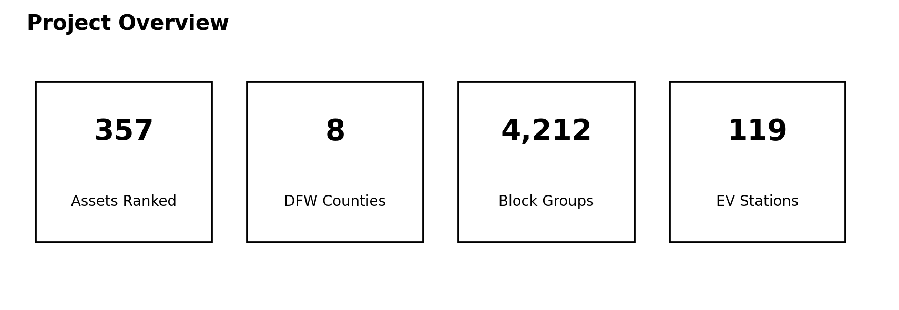
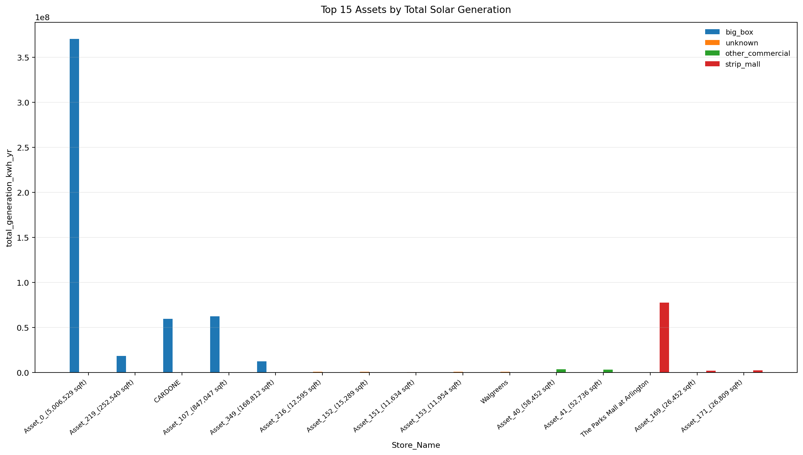
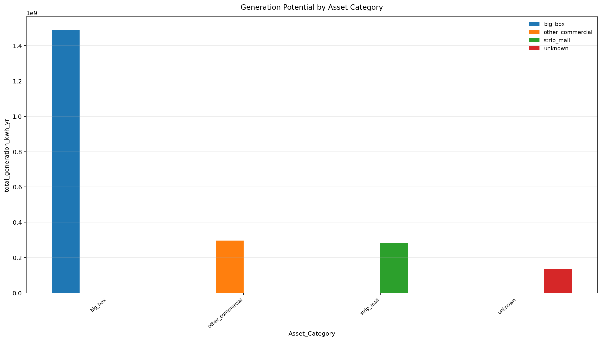
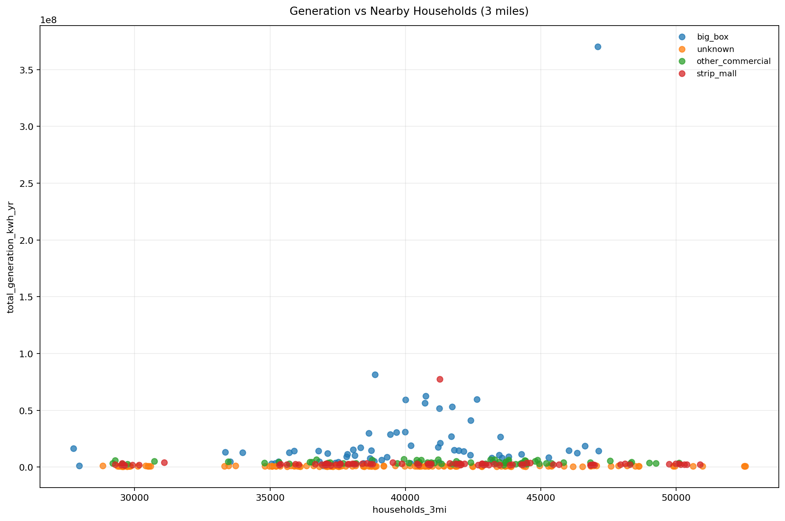
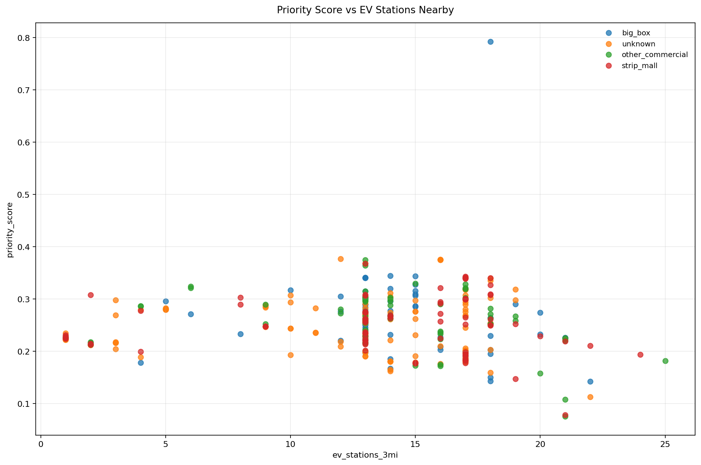
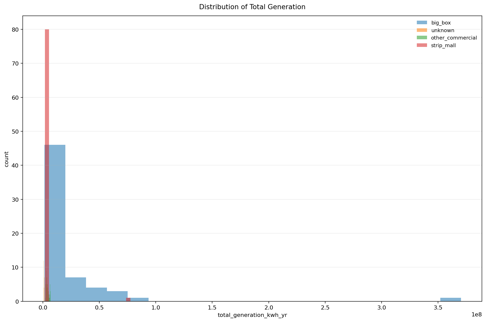
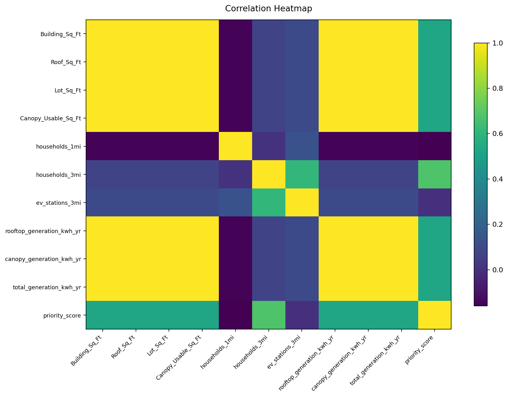
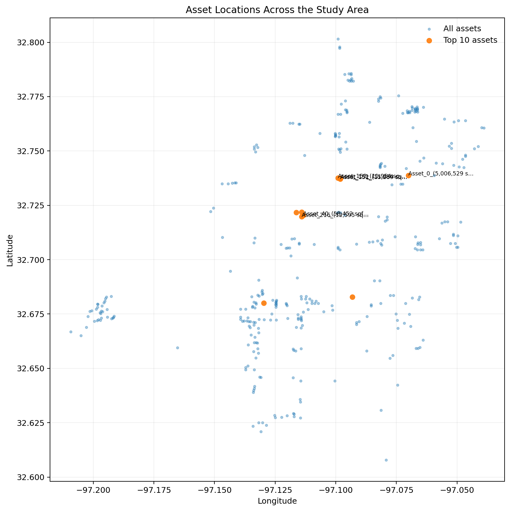
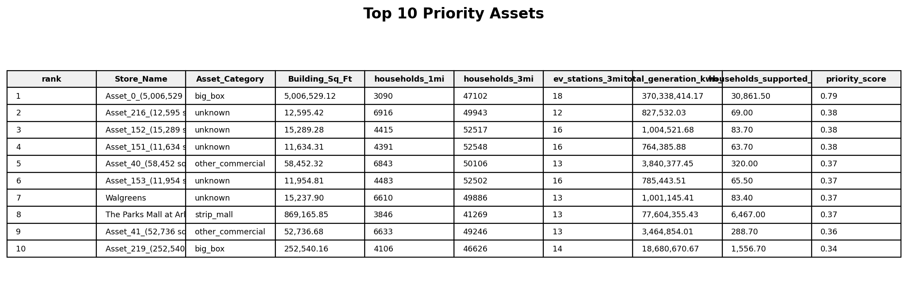
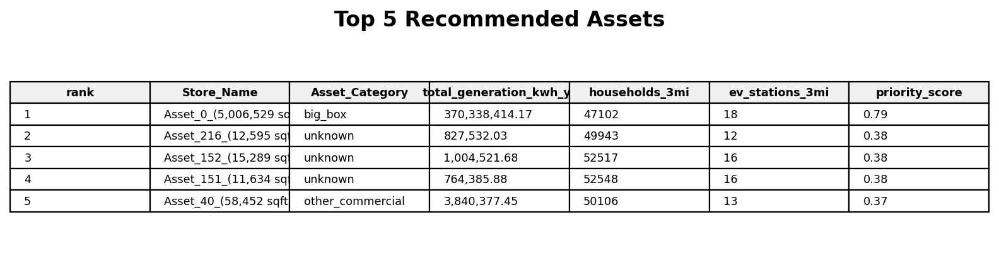

# ⚡ Energy Infrastructure Analytics App

This project ranks clean-energy opportunity sites across the Dallas–Fort Worth area using a mix of **solar generation potential**, **nearby households**, and **EV charging opportunity**.

I built it to answer a very practical question:

**If I had to prioritize energy assets across DFW, which sites would stand out once generation, local demand, and EV infrastructure are considered together?**

The result is a geospatial pipeline that scores assets, creates interactive visuals, and exports files that are ready for maps and dashboards.

---

## ✨ What’s inside

- **357 DFW assets** ranked with a weighted scoring model
- **Census ACS5** household reach added with **1-mile** and **3-mile** buffers
- **NREL API** data used to count nearby public EV stations
- exported outputs in **CSV**, **GeoJSON**, and **HTML**
- interactive dashboard files extracted from the notebook and saved in this repo

---

## 🎯 Project goal

I wanted this project to balance three ideas instead of over-optimizing for only one:

- **How much energy could the site generate?**
- **How many households are nearby?**
- **How saturated is the local EV charging network?**

That led to a weighted priority score:

- **50%** generation potential
- **30%** household reach
- **20%** EV gap

---

## 🛠️ Tools used

`Python` `Pandas` `GeoPandas` `Folium` `Plotly` `NumPy` `Requests` `Jupyter Notebook`

---

## 🧩 Data used

- building / asset data for Arlington / DFW sites
- **Census ACS5** block group household counts
- **TIGER/Line** block group geometry
- **NREL Alternative Fuel Stations API** for public EV stations

A copy of the uploaded building file used for the notebook is included here:

- `data/raw/arlington_buildings_10000+.csv`

---

## 🧱 Pipeline overview

### 1) Load and clean asset data
The project starts with building-level asset records and standardizes coordinates, names, and asset categories.

### 2) Estimate solar potential
For each asset, the notebook estimates:
- usable rooftop area
- usable canopy area
- annual generation potential
- estimated households supported

### 3) Add household reach
Using Census ACS5 and block group geometries, the project calculates households within:
- **1 mile**
- **3 miles**

### 4) Add EV charging context
Public EV station locations are pulled from the NREL API and counted within **3 miles** of each asset.

### 5) Score and rank assets
Each site gets a final priority score based on:
- generation
- households nearby
- EV gap

### 6) Export outputs
The pipeline saves map-ready and dashboard-ready outputs for easier presentation and follow-up analysis.

---

## 🔍 A few project results

These numbers come directly from the saved notebook output:

- assets loaded: **357**
- block groups loaded: **4,212**
- EV stations in study area: **119**
- highest energy potential asset: **Asset_0_(5,006,529 sqft)**
- top asset annual generation: **370,338,414 kWh/year**
- top asset priority score: **0.792**
- top asset household support estimate: **30,862 households/year**
- assets still classified as `unknown`: **40.3%**

---


## 🖼️ Dashboard preview

### Project overview


### Top assets by total solar generation


### Generation potential by asset category


### Generation vs nearby households


### Priority score vs EV stations nearby


### Distribution of total generation


### Correlation heatmap


### Asset locations


### Top assets table


### Top recommendations table



## 📊 Saved dashboard files

All saved notebook visuals are included in this repo.

### Open the dashboard hub
[Dashboard files index](dashboards/index.html)

### Interactive visuals
- [KPI cards](dashboards/exported_html/kpi-cards.html)
- [Top 15 Assets by Total Solar Generation](dashboards/exported_html/01-top-15-assets-by-total-solar-generation.html)
- [Generation Potential by Asset Category](dashboards/exported_html/02-generation-potential-by-asset-category.html)
- [Generation vs Nearby Households (3 miles)](dashboards/exported_html/03-generation-vs-nearby-households-3-miles.html)
- [Priority Score vs EV Stations Nearby](dashboards/exported_html/04-priority-score-vs-ev-stations-nearby.html)
- [Distribution of Total Generation](dashboards/exported_html/05-distribution-of-total-generation.html)
- [Correlation Heatmap](dashboards/exported_html/06-correlation-heatmap.html)
- [Interactive Asset Map](dashboards/exported_html/interactive-asset-map.html)

### Tables and notes
- [Top 25 Priority Assets](dashboards/tables/top-25-priority-assets.html)
- [Top 5 Recommended Assets](dashboards/tables/top-5-recommended-assets.html)
- [Project Insights](dashboards/notes/insights.md)

---

## 📁 Repository structure

```text
energy-infrastructure-analytics-app/
├── README.md
├── data/
│   └── raw/
│       └── arlington_buildings_10000+.csv
├── notebooks/
│   └── EV_PROJECT.ipynb
├── dashboards/
│   ├── exported_html/
│   ├── tables/
│   ├── notes/
│   └── index.html
├── outputs/
└── src/
```

---

## 📌 Main outputs created by the notebook

The notebook saves files such as:

- `asset_energy_summary.csv`
- `top25_priority_assets.csv`
- `assets_enriched.geojson`
- `household_block_groups.geojson`
- `asset_energy_map.html`
- `project_insights.txt`
- `ev_stations.geojson`

---

## 🚀 Why this project matters

What I like about this project is that it blends:
- geospatial analysis
- public API integration
- scoring logic
- infrastructure planning
- and dashboard-style presentation

It’s a strong portfolio piece because it does more than map points. It shows how to turn location data into a prioritization framework.

---

## 👩‍💻 Author

**Sejal Khade**  
Data Analyst | SQL | Python | Power BI | Tableau
